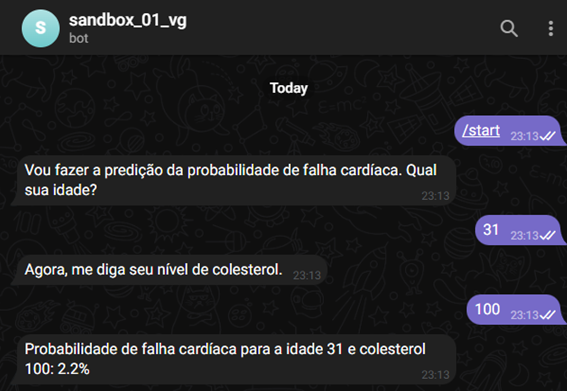
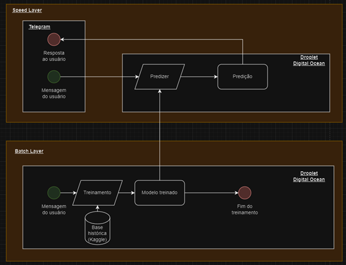

# Heart failure prediction app
Telegram chatbot PoC for heart failure prediction using a binary classifier.

## Screenshots
### New chat

### Main flow

## Architecture overview

## Useful links
- dataset: https://www.kaggle.com/datasets/fedesoriano/heart-failure-prediction/

- demo: https://t.me/sandbox_01_vg_bot

# Lets do more!
You can use it, if you want. Also, feel free to contribute with this repo.